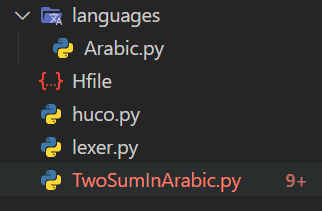

# Huco - write python Code in any Human language

This project was created and designed by Bassam El-Naggar

## What does it do?
Every programming language that I can think of is written in English. This can be a huge barrier to entry for someone trying to get into programming if their English is not strong. Huco acts as an interpreter between the programmer and the python interpreter. It takes code written in a human language (i.e Arabic, French, German, etc.) and translates it into valid pythonic code. This way, the programmer can write python code in whatever human language makes them most comfortable.

## Dependencies
- Python

## Usage
#### File Tree
The file tree is fairly simple. In the directory in which you are writing code, make sure you have the following files/directories:
- huco.py
- lexer.py
- Hfile
- languages - a directory which includes the language translations
	- `The language files you use are put here`

Here's an example file tree

### Using Languages
All languages will be defined in their own python file. The python file must include only one dictionary variable named 'languageMap'. This will be used by the lexer to translate the files. 

Here's an example of a language file

### The Hfile
A file that must be included is the Hfile. The Hfile contains configuration information for the interpreter to setup. There are four configurations:
- language - this tells the interpreter which file to look for in the languages directory to find the language map
- persist - can take a value of true or false; tells the interpreter whether or not to write the output to a file after translation
- overwrite - can take a value of true or false; tells the interpreter whether or not to overwrite any previous translations of the same name
- mode - can take a value of 'reverse'; tells the interpreter to translate from english to the chosen language

Here's an example Hfile

### Command Line
The command line usage is fairly simple. The first argument will be 'python' to invoke the python interpreter to run Huco. Next is the path to the untranslated file. The third argument is the path of the translated file. There is an optional argument after this one that is the path to the Hfile.

Here's an example

## Example
We put everything together in the following example:
This is the program

We run the following commmand in our terminal:

`python3 huco.py TwoSumInArabic.py output.py`

which produces this file

and this output in the terminal

## Feel free to create languages and share them with others!